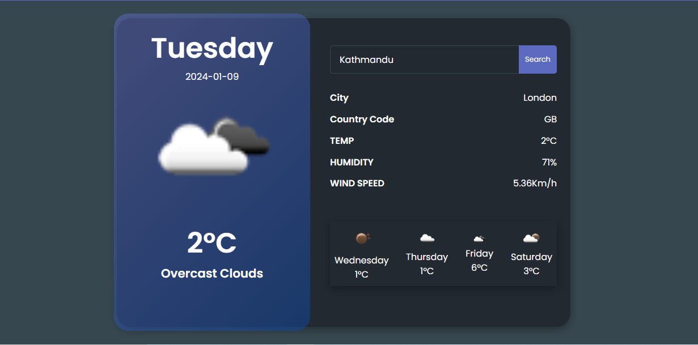

<!-- #  -->

Forked from mgmr99/weather-app

A simple application built with Laravel 10 that utilizes the OpenWeather API and GEOAPIFY API to provide real-time weather and location information.

As Edited By Euclide Andrae F. Arroyo for a Coding Examination for Bizmates PH.

## Features

-   **Current Weather**: Get the current weather conditions for a specific location.
-   **Forecast**: Retrieve a 5-day weather forecast for a given location.
-   **Location Details**: Retrieves Some Location data from GEOAPIFY API

## Getting Started

### Prerequisites

-   PHP >= 7.4
-   Composer
-   Laravel CLI

### Installation

1. Clone the repository:

    ```bash
    git clone https://github.com/your-username/your-weather-app.git

    ```

2. Navigate to the project directory:

    ```bash
    cd your-weather-app

    ```

3. Copy the .env.example file to .env and configure your API key:

    ```bash
    cp .env.example .env

    ```

4. Open the .env file and set your OpenWeather API key:

    ```bash
        OPENWEATHER_API_KEY=your-api-key
        GEOAPIFY_API_KEY=your-api-key

    ```

5. Run the migrations:

    ```bash
        php artisan migrate

    ```

6. Serve the application
    ```bash
        php artisan serve
    ```

Visit http://localhost:8000 in your browser.

## Usage

Navigate to the home page.
Enter the city name or coordinates.
Click on the "Search" button to retrieve current conditions or forecasts.

## Explanation

I will Admit that the code was made hastily but this project shows my adapatibility and resourcefulness in using resources available to me.
It also shows my ability to learn new skills fast and understand how to use API that previously was not known to me.

I Used the autocomplete provided by geoapify to make the user experience more cleaner and be able to be more precise at the same time
Since this app will not be the main research tool and only give some details, we also provide the website of the location also provided by the API Becuase of this, and Timezone as well
